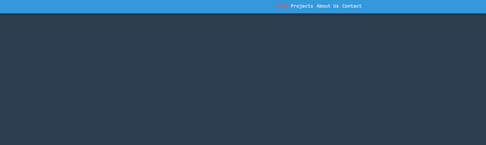

# Reactive Navbar

## Overview  
This is a responsive navigation bar that features a toggle button to show and hide the navigation links. The design is optimized for mobile and desktop views.

## How It Works  
- The navigation bar includes a toggle button that controls the visibility of the navigation links on smaller screens.  
- On larger screens, the navigation links are displayed by default.  
- On smaller screens, clicking the toggle button expands or collapses the navigation links.

## Screenshots  
1. **Collapsed View**:  
     
2. **Expanded View**:  
     

## Files Included:  
- `style.css`: CSS for styling.  
- `script.js`: JavaScript for toggle functionality.

## How to Use  
1. Include the CSS and JS files in your project.  
2. Copy the provided HTML structure into your page.  
3. Click the toggle button to expand or collapse the navigation links on smaller screens.

## Benefits  
- **Responsive Design**: Ensures the navbar looks and functions well on both mobile and desktop devices.  
- **Improved User Experience**: Makes navigation simple and intuitive by allowing users to expand or collapse the menu.  
- **Performance Optimized**: Lightweight and efficient CSS and JS ensure fast loading times and better performance.  
- **Customizability**: Easily customizable to match your website’s theme and style.  
- **Better Usability**: Enhances usability by hiding unnecessary navigation links on smaller screens, reducing clutter.

## Future Enhancements  
- **Dark Mode Support**: Adding a dark mode option for better usability in low-light environments.  
- **Sticky Navigation**: Implementing a sticky version of the navbar for better accessibility.  
- **Dropdown Menus**: Adding dropdown menus to improve navigation for larger, nested links.  
- **Customizable Transitions**: Allowing users to customize transition effects for smoother animations.  
- **Accessibility Improvements**: Enhancing keyboard navigation and ARIA roles to improve accessibility.  

---
Feel free to fork and make changes. Contributions are welcome!

